La aplicacion se creo mediante el Visual Studio Code es 100% java se ejecuta en el main.java adentro de el archivo.zip y si tiene algun error ejecutar el InitDataBase.java

Autentificacion:

FabricaApp:

Aqui esta la clase pricipal FabricaDeCaramelos yo le puse Empresa para guiarme mejor. Ahi cree varias partes de la interfaz como Card, CardPedidos, 
HomeFabic, PanelFabric, PanelPedidos y PanelScroll. Aqui les dejo capturas de pantalla de como funciona mi parte del proyecto:

En esta foto se muestra cuando se ingresan datos como la cantidad de materia prima y cuanto hay que pagar por esa materia prima y de que tipo es:
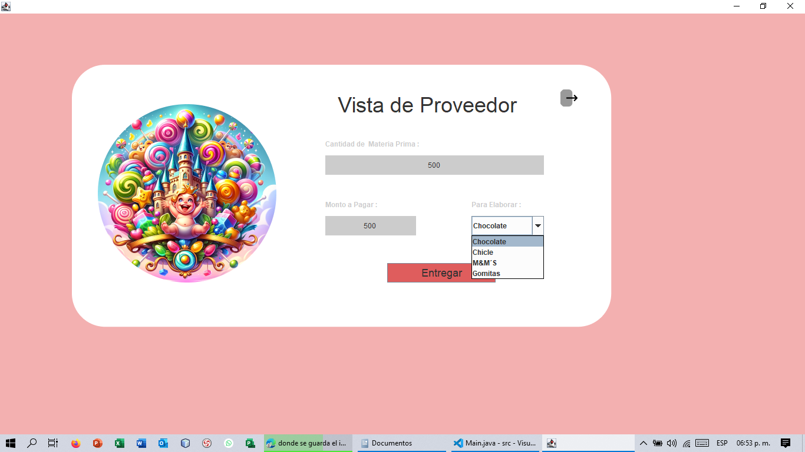

En esta foto se muestra como se guardaron esos datos:
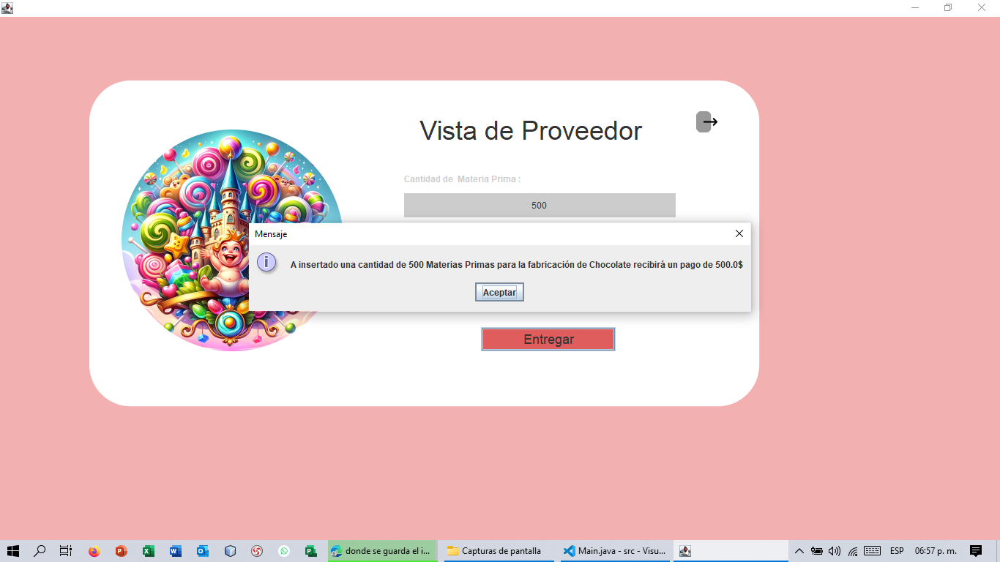

En esta foto se muestra como se puede modificar los proveedores:
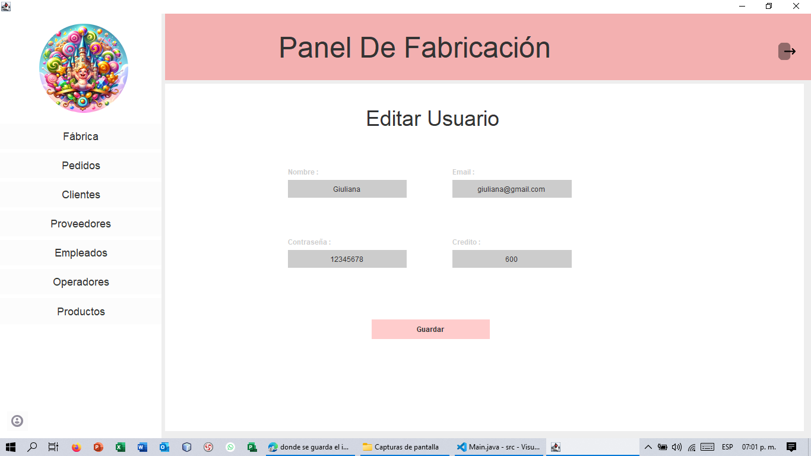

En esta foto se muestra como se guardaron las modificaciones:
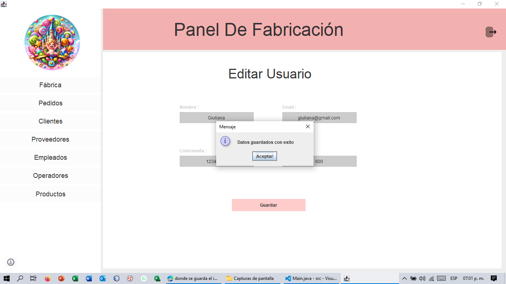

En esta foto se muestra como se eliminan los proveedores:
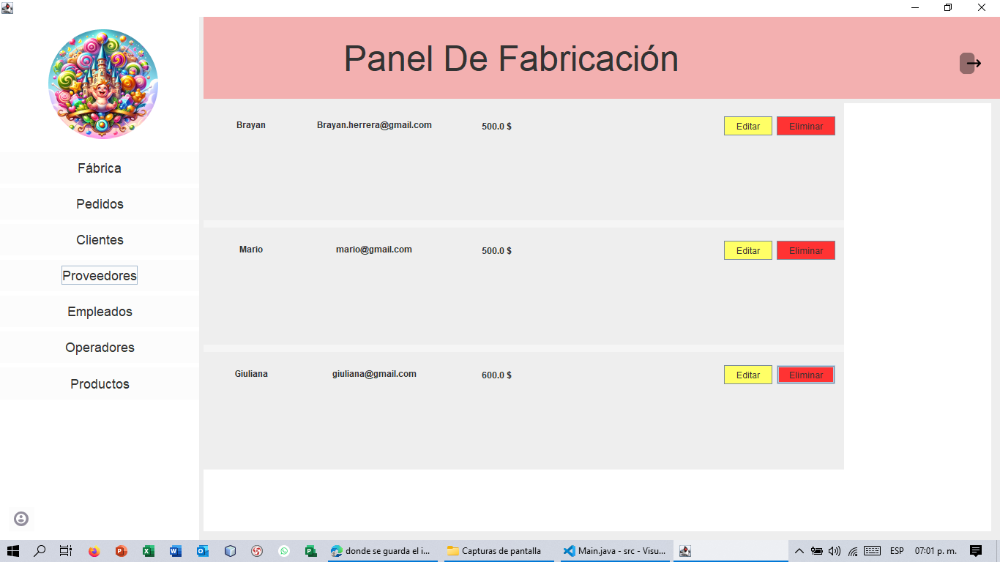

En esta foto se muestra como se elimino el proveedor Giuliana:
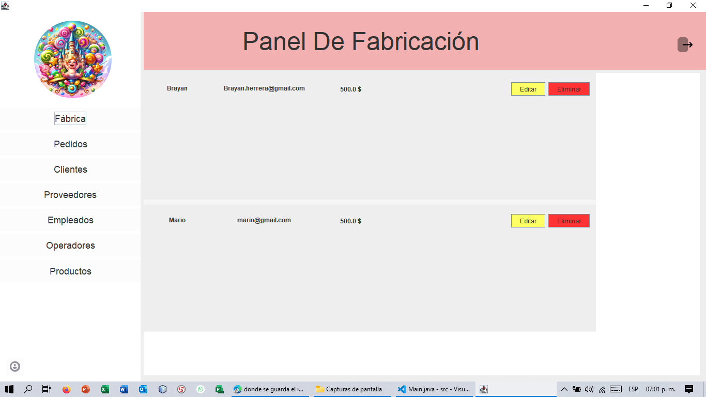

ProcesoDeElaboracion:

VentaDeCaramelos:

En esta carpeta se encuentran las clases Compra.java , Pedidos.java y ProductosDeConfituras.java . Tambien se encuentran las interfaces AddPedido.java y HomeShopping,java . Aqui les dejo capturas de pantalla de como funciona mi parte del proyecto:

En esta foto se muestra la pagina de los pedidos: 
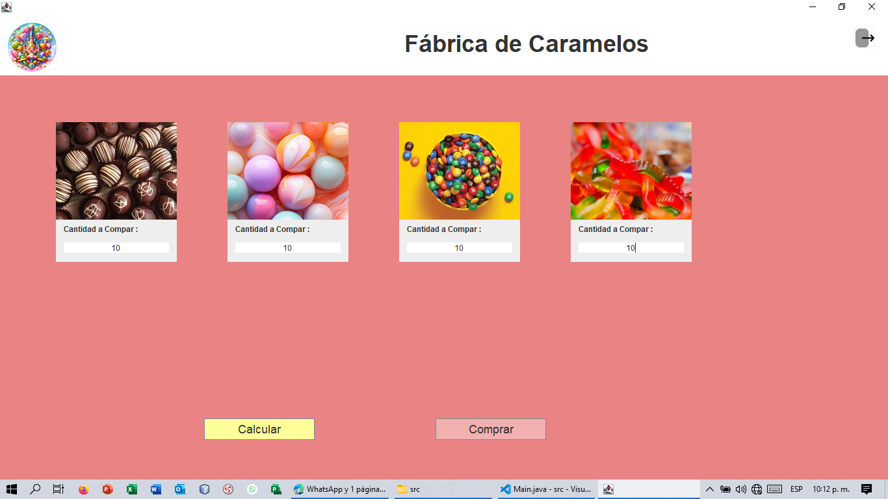

En esta foto se muestra que pasa cuando tocas el boton comprar:
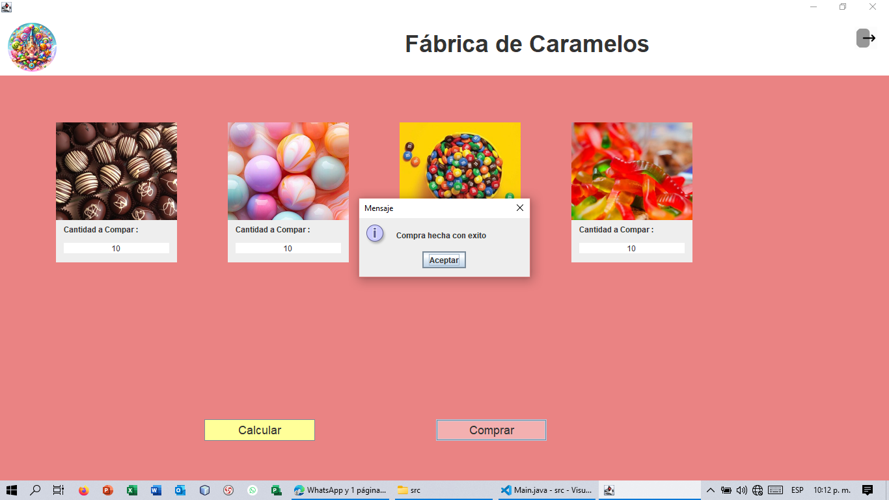

En esta foto se muestra que pasa cuando tocas el boton calcular:
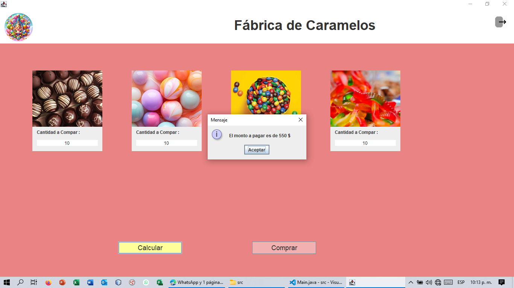

En esta foto se muestra los pedidos realizados:

En esta foto se muestra la funcionalidad de agregar pedidos:
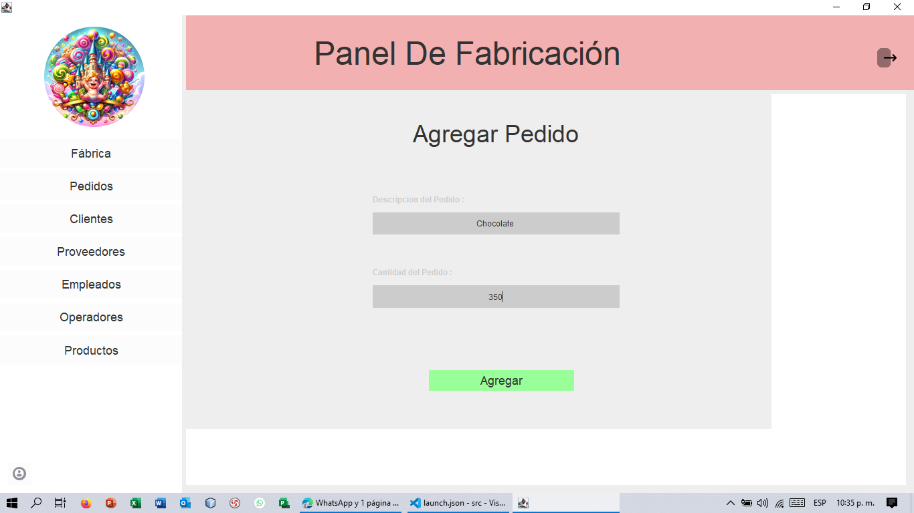

En esta foto se muestra la validez de agregar pedidos:
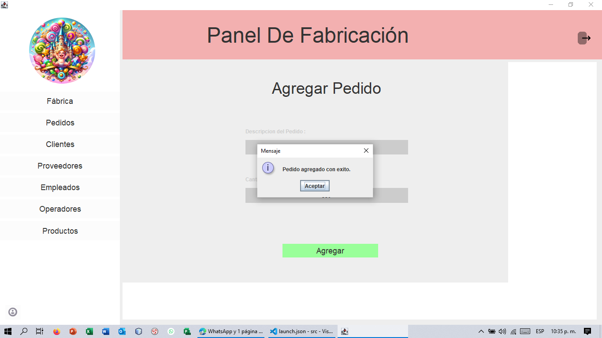

En esta foto se muestra la nueva lista de pedidos:
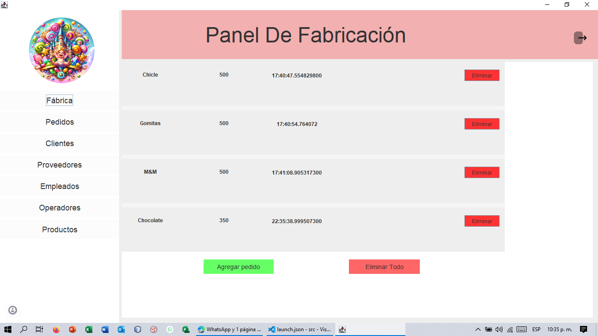

En esta foto se muestra la funcionalidad de eliminar pedidos:

